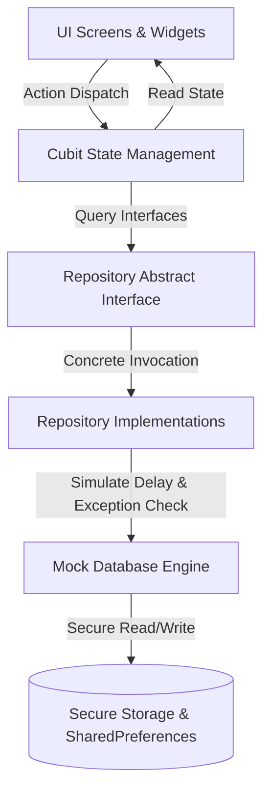

# TaskFlow Architecture Documentation

This document describes the high-level architecture, design decisions, and system implementation details of the **TaskFlow** project management mobile application.

---

## 1. Architectural Structure (Feature-First Layering)

TaskFlow is structured using a **Feature-First** folder structure, separating concerns cleanly across distinct modules (Features) and architectural layers.

```
lib/
├── app/                  # Application-wide configurations
│   ├── localization/     # Localization assets/translation keys
│   └── theme/            # Global styling system (AppColors & AppTheme)
├── core/                 # Shared logic and global services
│   └── data/             # Central mock database data source engine
├── features/             # Feature modules containing layered components
│   ├── auth/             # Login, signup, session lifecycle
│   ├── notifications/    # Scoped user alert feeds
│   ├── projects/         # Dashboard metrics and projects CRUD
│   └── tasks/            # Comments feed, assignee checks, tasks list
│
# Architectural Layers inside each feature:
# ├── data/               # Models (JSON parsing) and Repository implementations
# ├── presentation/       # Cubits (state managers) and Screens (UI)
```

### Layer Responsibilities
1. **Data Source (`core/data/`)**: Acts as the database controller, parsing `mock-data.json` at startup and managing mutated collections in memory.
2. **Repository Layer**: Provides abstract interfaces defining CRUD and query methods. Swapping simulated storage for a real HTTP service only requires swapping out the implementation class (`Impl`) while keeping interfaces intact.
3. **Business Logic Layer (Cubits)**: Manages state transitions using `flutter_bloc`. Emits explicit state classes (Initial, Loading, Success, Empty, Error) while keeping UI widgets decoupled from business logic.
4. **Presentation Layer (Screens/Widgets)**: Renders the user interface. Adapts responsively using `flutter_screenutil` and binds layout translations using `easy_localization`.

---

## 2. System Architecture Diagram



---

## 3. Core Design Implementations

### 🔑 Simulated Session & Refresh Daemon Flow
- **Authentication Credentials**: User profiles are stored inside the in-memory mock database and validated against test credentials.
- **Secure Persistence**: Successful authentication stores the `access_token` and `refresh_token` inside the OS-level credential vault using `flutter_secure_storage`.
- **Silent Refresh Daemon**: `AuthCubit` launches a periodic timer daemon (`10-second` check frequency). If the access token is within its expiration lifespan limit (configured to `15 minutes`), it fires a mock token refresh API call to silent-update session credentials without user disruption.

### 📶 Simulated Offline Caching & Sync
- **Local Cache Persistence**: Successful project and task fetches are serialized into JSON strings and persisted in local disk databases using `SharedPreferences`.
- **Offline Auto-Fallback**: If the simulated network is offline, repository methods catch connectivity exceptions, load the last cached JSON matching that workspace scope, and emit lists flagged with `isStale = true`.
- **Stale Indicators**: The UI presents warning banners (**"Stale Data (Offline Mode)"**) at the top of list items to notify the user.

### 🛠️ Developer Testing Panel
Accessible via the navigation drawer, this panel lets reviewers verify app constraints:
- **Simulate Offline**: Cuts network calls to test caching and recovery banners.
- **Error Injections**: Triggers specific status code blocks (404 Not Found, 504 Timeout, Validation failures).
- **Silent Refresh Trigger**: Forces access token expiration immediately to demonstrate active silent refresh loops.
- **Mock DB Reset**: Restores mock database collections to their pristine original values.

---

## 4. Architectural Trade-offs & Decisions
1. **In-Memory Mock Database**: Kept the data source in-memory for simpler state tracking without the complexity of database libraries (like SQLite/Isar), satisfying the mock-brief goals.
2. **Repository Parameter Injection**: Injected `SharedPreferences` at the repository layer, allowing the repository implementation class to handle fallback caching operations autonomously.
3. **Dynamic Theme Cubit**: Controlled theme swaps through a dedicated `ThemeCubit`, persisting user choices on disk across app restarts.
